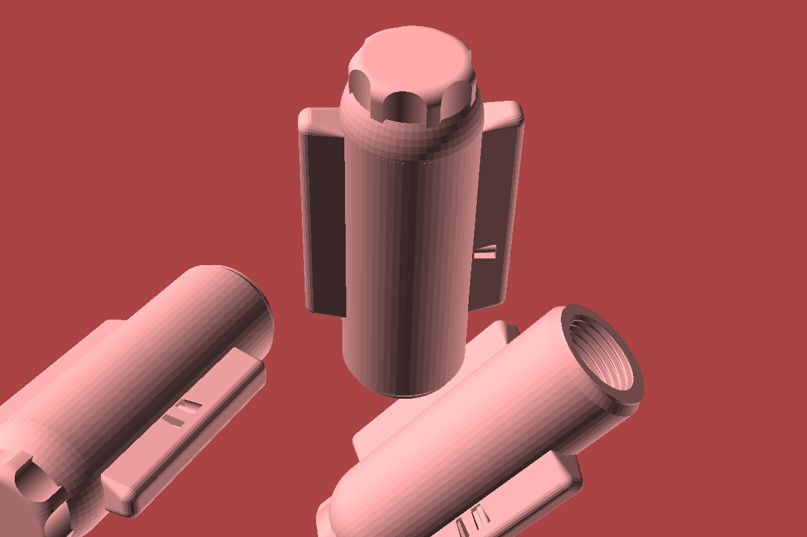
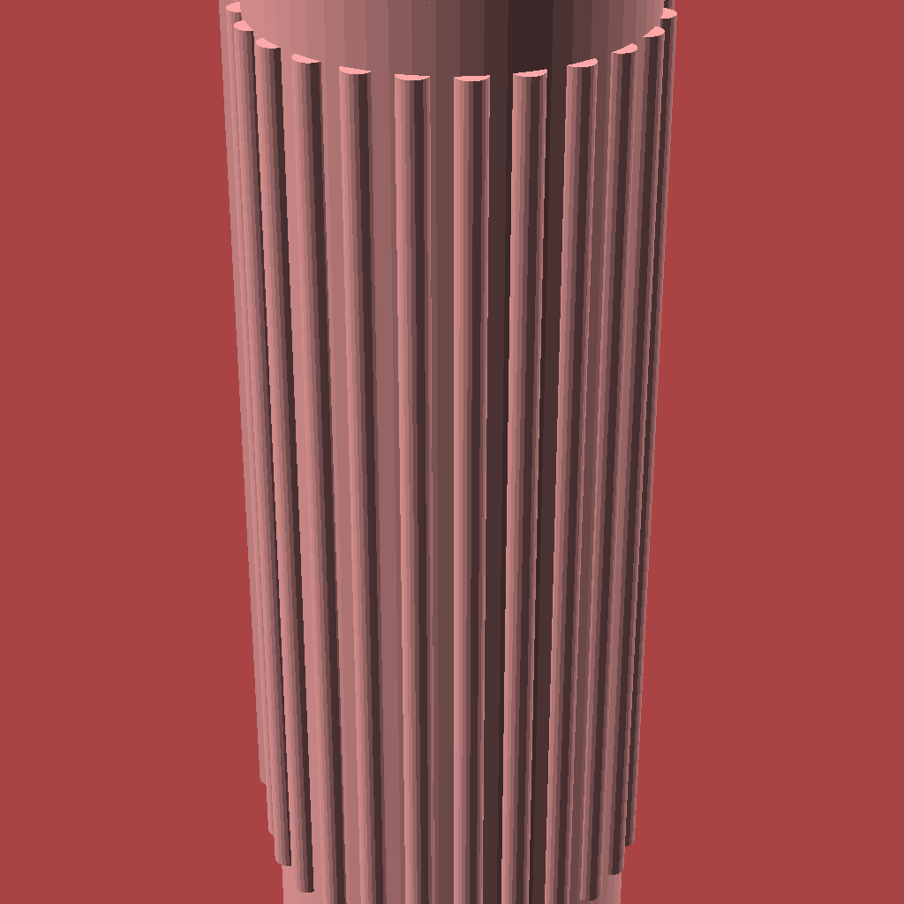
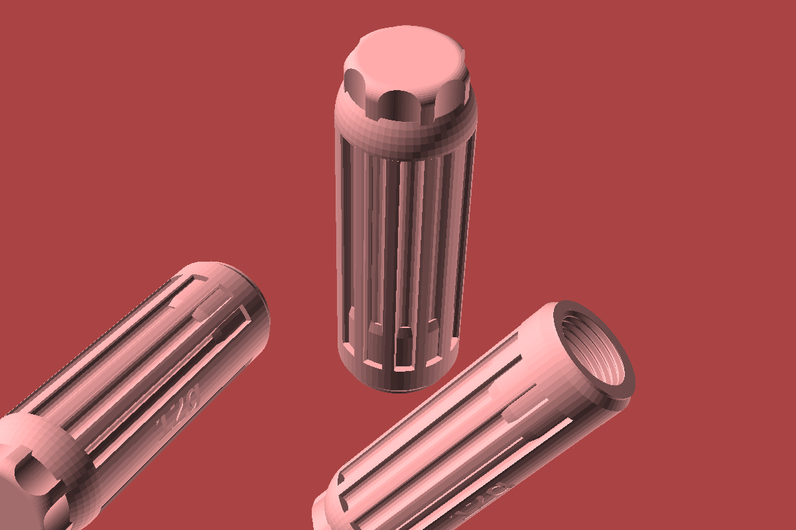
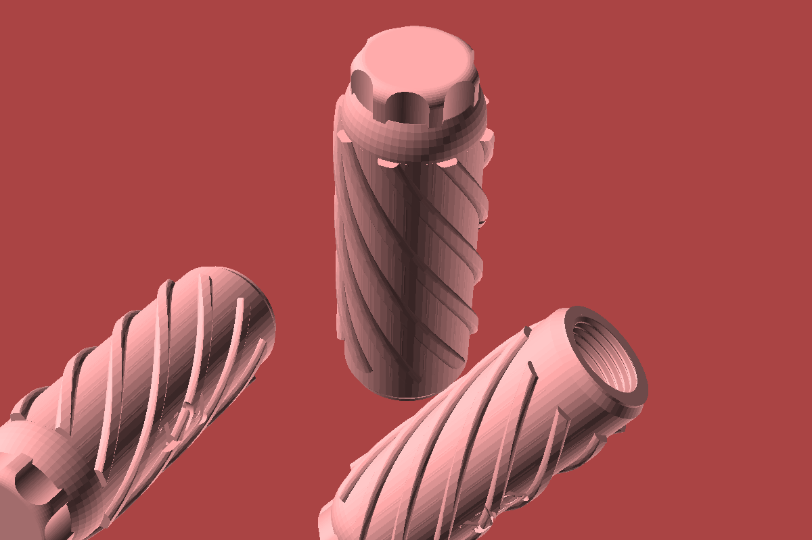

# 🍾 GIMAS Soda Siphon CO2 Cartridge Holder (8g & 12g)

[](https://openscad.org/)
[](LICENSE)
[]()

Cześć! Wrzucam tutaj projekt fajnych, zgrabnych uchwytów (nakładek) na naboje CO2 (te małe 8g i te większe 12g) do klasycznych syfonów **GIMAS**. 

Pliki STL to jedna, spójna bryła (watertight) z wbudowanym gwintem **M20.7 x 2.0**, który pasuje prosto do metalowej szyjki syfonu. Od góry jest zaokrąglona czapeczka, żeby nabój ładnie siedział i dociskał iglicę.

---

## 🎨 4 Wyglądy do wyboru

Mamy tu 4 opcje stylistyczne, każda dla wersji 8g i 12g:

| # | Jak wygląda | Nazwa | O co chodzi? | Plik STL (8g) | Plik STL (12g) |
|---|:---:|-------------|------|---------------|----------------|
| **1** |  | **Modern Minimalist** | Gładziutki z dwoma łopatkami, dobrze leży w łapie, łatwo umyć | [`8g Modern`](stl/gimas_co2_8g_styl1_modern.stl) | [`12g Modern`](stl/gimas_co2_12g_styl1_modern.stl) |
| **2** |  | **Industrial Knurled** | Nacięte paski wzdłuż, super chwyt, nawet jak masz mokre ręce | [`8g Knurled`](stl/gimas_co2_8g_styl2_knurled.stl) | [`12g Knurled`](stl/gimas_co2_12g_styl2_knurled.stl) |
| **3** |  | **Retro Fluted** | Klasyczne, głębsze rowki. Wygląda jak stare syfony z lat 70. | [`8g Fluted`](stl/gimas_co2_8g_styl3_fluted.stl) | [`12g Fluted`](stl/gimas_co2_12g_styl3_fluted.stl) |
| **4** |  | **Ergonomic Spiral** | Zakręcony świderek, wygodnie się dokręca | [`8g Spiral`](stl/gimas_co2_8g_styl4_spiral.stl) | [`12g Spiral`](stl/gimas_co2_12g_styl4_spiral.stl) |

---

## 📚 Gdzie szukać pomocy?

W folderze [`docs/`](docs/) wrzuciłem kilka poradników:

1. 🖨️ **[Poradnik Druku 3D](docs/TUTORIAL_3D_PRINTING.md)**
   - Jak to pociąć w slicerze (Prusa, Bambu, Cura).
   - Z czego drukować (spoiler: PETG wymiata), żeby gwint nie strzelił.
   - Jak ustawić to na stole (podpowiem: bez podpór!).

2. 🛠️ **[Poradnik Modyfikacji w OpenSCAD](docs/TUTORIAL_OPENSCAD_CUSTOMIZATION.md)**
   - Jak bawić się suwakami w `scad/gimas_co2_holder.scad`.
   - Jak dodać własny tekst na boku.
   - Jak odpalić skrypty, jak wolisz klepać w terminalu.

3. 🍾 **[Instrukcja do Syfonu GIMAS](docs/SIPHON_USAGE_GUIDE.md)**
   - Krótka ściąga, jak ładować gaz i nie zrobić w kuchni powodzi.

---

## 🖨️ Drukujemy (szybka ściąga)

> [!TIP]
> **Na szybko:**
> - **Pozycja:** Dnem do dołu (gwint na górze).
> - **Warstwa:** `0.16 mm` (dla ładnego gwintu) albo `0.20 mm`.
> - **Obrysy (Walls):** Dajcie co najmniej **4-5**, żeby gwint wytrzymał wkręcanie!
> - **Wypełnienie:** `25% - 30%` (Gyroid robi robotę).
> - **Podpory:** **Wyłącz**, szkoda plastiku, wydrukuje się ładnie bez tego.
> - **Filament:** **PETG** to król w tym przypadku, ewentualnie ASA/ABS.

---

## 🛠️ Zabawa z OpenSCADem

Plik [`scad/gimas_co2_holder.scad`](scad/gimas_co2_holder.scad) to czysty kod, możesz zmieniać co chcesz.

### Jak zrzucić model z konsoli:
```bash
# Szybki 8g Modern:
openscad -D 'size="8g"' -D 'style=1' -o stl/gimas_co2_8g_styl1_modern.stl scad/gimas_co2_holder.scad

# Albo 12g w prążki:
openscad -D 'size="12g"' -D 'style=2' -o stl/gimas_co2_12g_styl2_knurled.stl scad/gimas_co2_holder.scad
```

### Chcesz machnąć wszystko na raz?
Mamy skrypt w Pythonie:
```bash
python3 scripts/build_stl_and_renders.py
```

---

## 📐 Wymiary i technikalia

- **Gwint:** M20.7 x 2.0 (taki nietypowy, ale w syfonach siedzi idealnie).
- **Całkowita długość 8g:** 73.0 mm (szerokość to 30.0 mm).
- **Całkowita długość 12g:** 90.0 mm (szerokość ta sama).
- **Góra:** Zaokrąglona czapeczka, która bezpiecznie dopycha nabój do iglicy.

---

## 📜 Licencja

Bawcie się dobrze, projekt jest na licencji [MIT](LICENSE).
